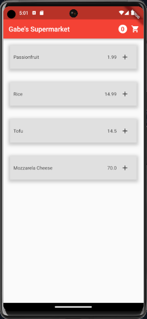
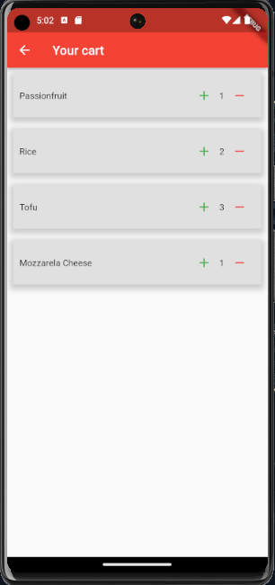

# SuperMarket App

App to test my knowledge about state management and material UI in flutter. Feel free to open a pull request if you think something should be improved.

Learning flutter from the book "Flutter complete reference", by Alberto Miola

